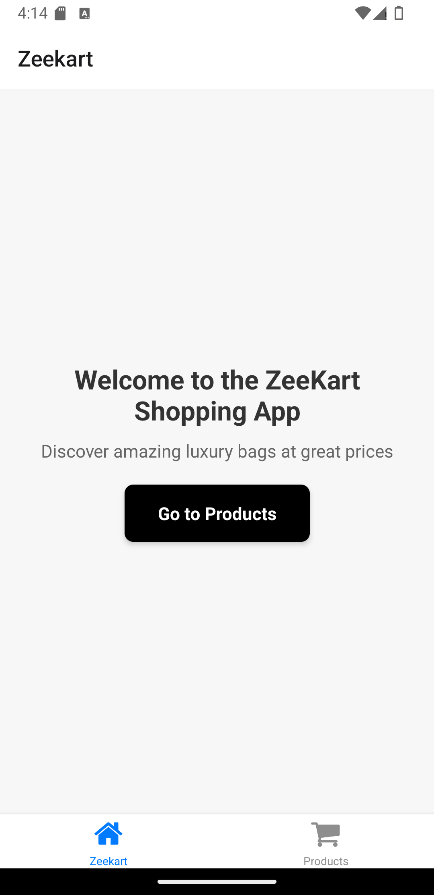
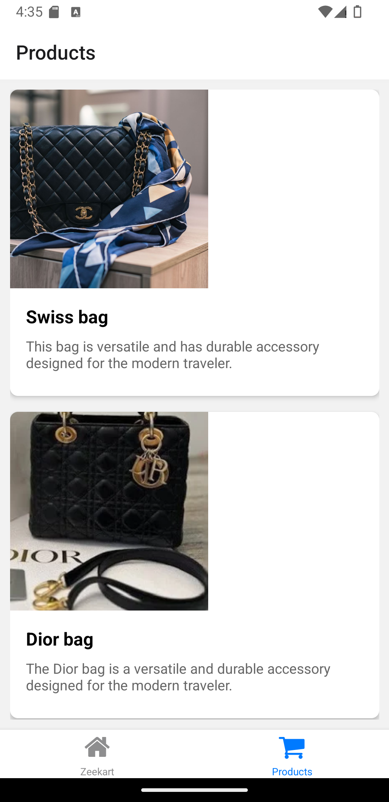

# Zeekart Shopping App

Welcome to the Zeekart Shopping App, a React Native application designed with a user-friendly interface featuring a bottom navigation bar and essential functionalities for browsing luxury bags and managing a shopping cart.

## Table of Contents

- [Features](#features)
- [Screenshots](#screenshots)
- [Installation](#installation)
- [Usage](#usage)
- [APK Download](#apk-download)
- [Live Demo](#live-demo)

## Features

- **Welcome Screen**: View items added to the cart and proceed to checkout.
- **Products Screen**: Browse and view a list of products.


## Screenshots

### Welcome Screen


### Products Screen



## Installation

1. Clone the repository:
   ```bash 
   git clone https://github.com/Zeemari/zeekart-shoppingapp.git
   ```

2. Navigate to the project directory:
   ```bash
   cd zeekart-shoppingapp
   ```
3. Install dependencies:
   ```bash
   npm install
   ```
4. Start the application:
   ```bash
   npm start
   ```

## Usage

1. Open the Expo Go app on your device.
2. Scan the QR code generated by `npm start` to run the app on your device.

## APK Download

You can download the APK file [here](https://drive.google.com/file/d/1oJB4TKw6yN3LbbA8MDLIRdqZAa5iFg4u/view?usp=drive_link).

## Live Demo

Check out the live demo on Appetize.io [here](https://appetize.io/app/android/com.drsaffas.zeekart?device=pixel7&osVersion=13.0).

## Contributing

Contributions are welcome! Please fork the repository and submit a pull request.

