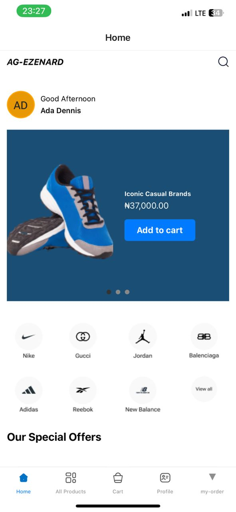
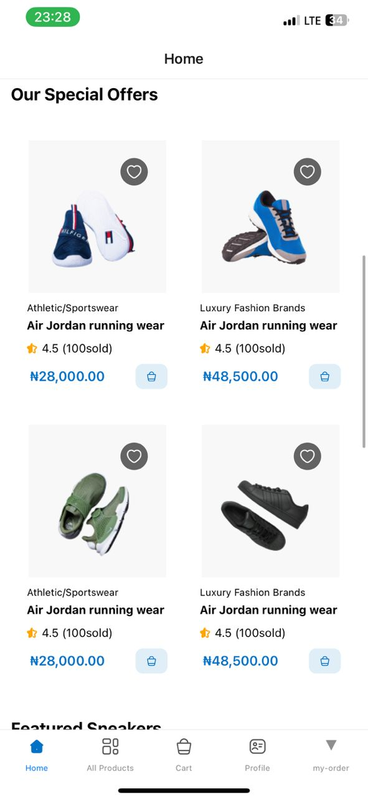
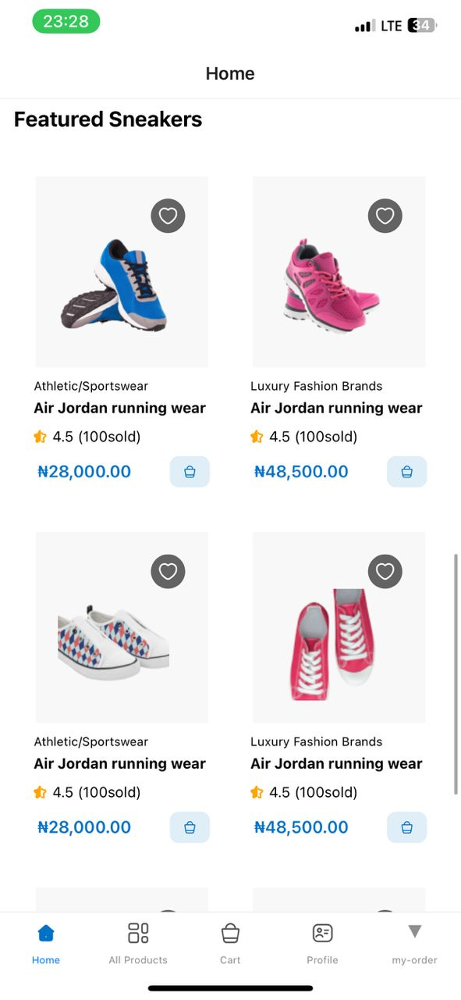
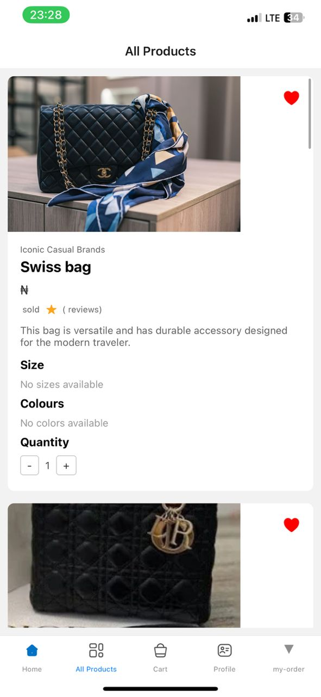
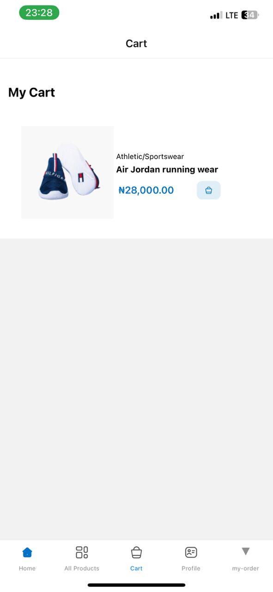

# Timbu Shopping App

Welcome to the Timbu Shopping App, a React Native application designed with a user-friendly interface of a Figma UI design featuring all products, cart and .

## Table of Contents

- [Features](#features)
- [Screenshots](#screenshots)
- [Installation](#installation)
- [Usage](#usage)
- [APK Download](#apk-download)
- [Live Demo](#live-demo)

## Features

- **Design Screen**: View UI implemented with the figma design.
- **All Products Screen**: Browse and view a list of products.
- **Cart**: Browse and view a list items added to cart.


## Screenshots

### Design Screen




### Products Screen


### Cart Screen



## Installation

1. Clone the repository:
   ```bash 
   https://github.com/Zeemari/tumbu-app.git
   ```

2. Navigate to the project directory:
   ```bash
   cd tumbu-app
   ```
3. Install dependencies:
   ```bash
   npm install
   ```
4. Start the application:
   ```bash
   npm start
   ```

## Usage

1. Open the Expo Go app on your device.
2. Scan the QR code generated by `npm start` to run the app on your device.

## APK Download

You can download the APK file [here](https://drive.google.com/file/d/1s0oVYzZ0ZUo7nBNuP1r7mlmun3l_eJJu/view?usp=drive_link).

## Live Demo

Check out the live demo on Appetize.io [here](https://appetize.io/app/b_eczffq2tfjtd4prdwgij6k24uq?device=pixel7&osVersion=13.0).

## Contributing

Contributions are welcome! Please fork the repository and submit a pull request.

