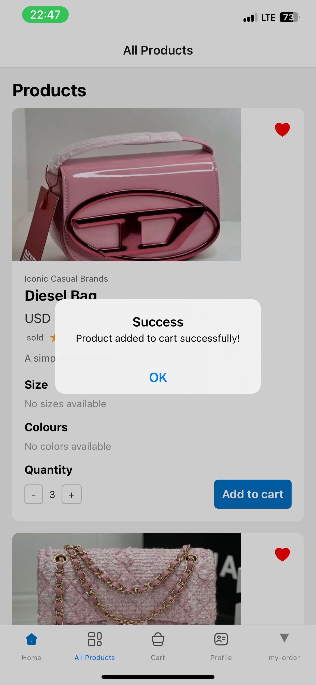

# Timbu Shopping App

Welcome to the Timbu Shopping App, a React Native application with a user-friendly interface inspired by a Figma UI design. The app features a home page with a slider showcasing various items and special offers, as well as highlighted products. Despite the challenges, I have worked hard to implement few of  the requirements and i will continue to strive for improvement in mobile development.

## Table of Contents

- [Features](#features)
- [Screenshots](#screenshots)
- [Installation](#installation)
- [Usage](#usage)
- [APK Download](#apk-download)
- [Live Demo](#live-demo)

## Features

- **Design Screen**: UI implemented based on the Figma design, with items fetched from the Timbu Cloud API.
- **All Products Screen**: Browse and view a list of products where a user can increase and decrease number of items and successfully add to cart.
- **Cart**: View and manage items added to the cart and proceed to checkout.
- **Product Details Screeen**: View detailed information about a specific product and add it to the cart.
Screen.

## Screenshots

### Home Screen


### Products Screen


### Special Offers Screen


### Featured Products Screen


### Product Details Screen


### Cart Screen


## Installation

1. Clone the repository:
   ```bash 
   https://github.com/Zeemari/tumbu-app.git
   ```

2. Navigate to the project directory:
   ```bash
   cd tumbu-app
   ```
3. Install dependencies:
   ```bash
   npm install
   ```
4. Start the application:
   ```bash
   npm start
   ```

## Usage

1. Open the Expo Go app on your device.
2. Scan the QR code generated by `npm start` to run the app on your device.

## APK Download

You can download the APK file [here](https://drive.google.com/file/d/1yndlqwXJfyvduvmSHjjhrAPVVYwUAtDL/view?usp=sharing).

## Live Demo

Check out the live demo on Appetize.io [here](https://appetize.io/app/b_j6om2tjy2lkhnd54xkpbdzmaey?device=pixel7&osVersion=13.0).

## Contributing

Contributions are welcome! Please fork the repository and submit a pull request.

